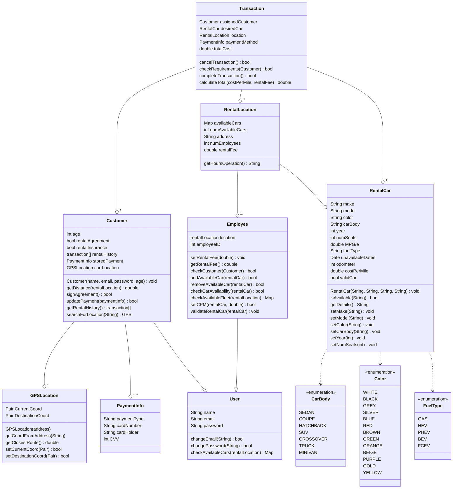

---
UML Class Diagram
---

# Description
## Enumerations
Starting off at the bottom of the UML diagram, from right to left, we have three enumerations for CarBody, Color, and FuelType that the RentalCar class will use. Because of the variability in how an employee could input these values, we've streamlined it using these enumerations to keep it consistent across all cars.
## User
The `User` class is a superclass of both `Customer` and `Employee`. The user class is what lets us create individual account access to the system. The `User` class contains name, email, and password that is required for either types of accounts. The functions that are in the class is general account manipulation and availability of vehicles given a location it gets passed
## Payment info
The `PaymentInfo` class is another object that a customer creates either one or more instances of. This class contains credit card information that can be stored and used for future transactions.
## GPS Location
The `GPSLocation` class manages directions to and from a customers location to a given rental location using coordinates that the class finds given an address string passed by the customer. Any function that requires location for finding directions of will use the `GPSLocation` class.