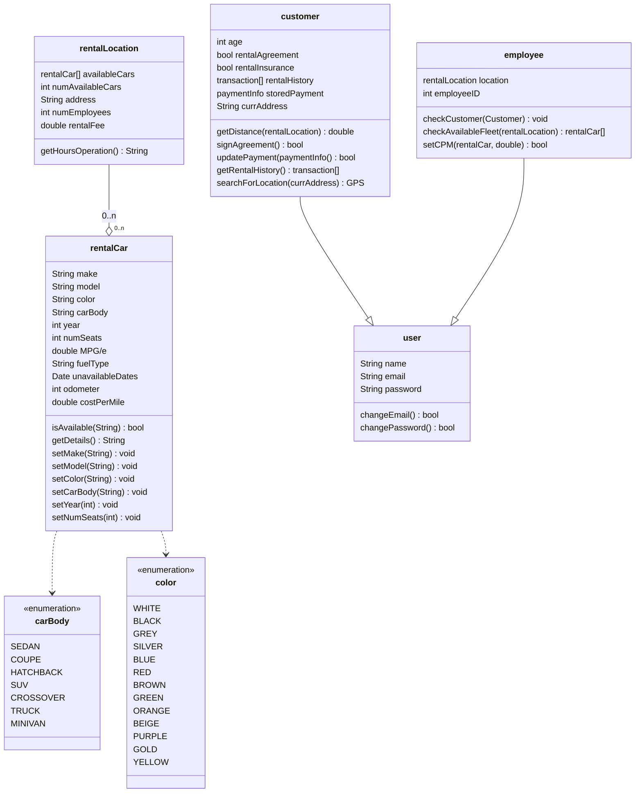

---
UML Class Diagram
---

```mermaid
classDiagram
    rentalCar ..> carBody
    rentalCar ..> color
    rentalLocation --o "0..n" rentalCar : 0..n
    customer --|> user
    employee --|> user
    
    class user {
        String name
        String email
        String password
        changeEmail() bool
        changePassword() bool
    }

    class customer {
        int age
        bool rentalAgreement
        bool rentalInsurance
        transaction[] rentalHistory
        paymentInfo storedPayment
        String currAddress
        
        getDistance(rentalLocation) double
        signAgreement() bool
        updatePayment(paymentInfo() bool
        getRentalHistory() transaction[]
        searchForLocation(currAddress) GPS
    }
    
    class employee {
        rentalLocation location
        int employeeID
        
        checkCustomer(Customer) void
        checkAvailableFleet(rentalLocation) rentalCar[]
        setCPM(rentalCar, double) bool
    }

    class rentalCar {
        String make
        String model
        String color
        String carBody
        int year
        int numSeats
        double MPG/e
        String fuelType
        Date unavailableDates
        int odometer
        double costPerMile

        isAvailable(String) bool
        getDetails() String
        setMake(String) void
        setModel(String) void
        setColor(String) void
        setCarBody(String) void
        setYear(int) void
        setNumSeats(int) void
    }
    
    class rentalLocation {
        rentalCar[] availableCars
        int numAvailableCars
        String address
        int numEmployees
        double rentalFee
        
        getHoursOperation() String
    }

    class carBody {
        <<enumeration>>
        SEDAN
        COUPE
        HATCHBACK
        SUV
        CROSSOVER
        TRUCK
        MINIVAN
    }

    class color {
        <<enumeration>>
        WHITE
        BLACK
        GREY
        SILVER
        BLUE
        RED
        BROWN
        GREEN
        ORANGE
        BEIGE
        PURPLE
        GOLD
        YELLOW
    }
```
