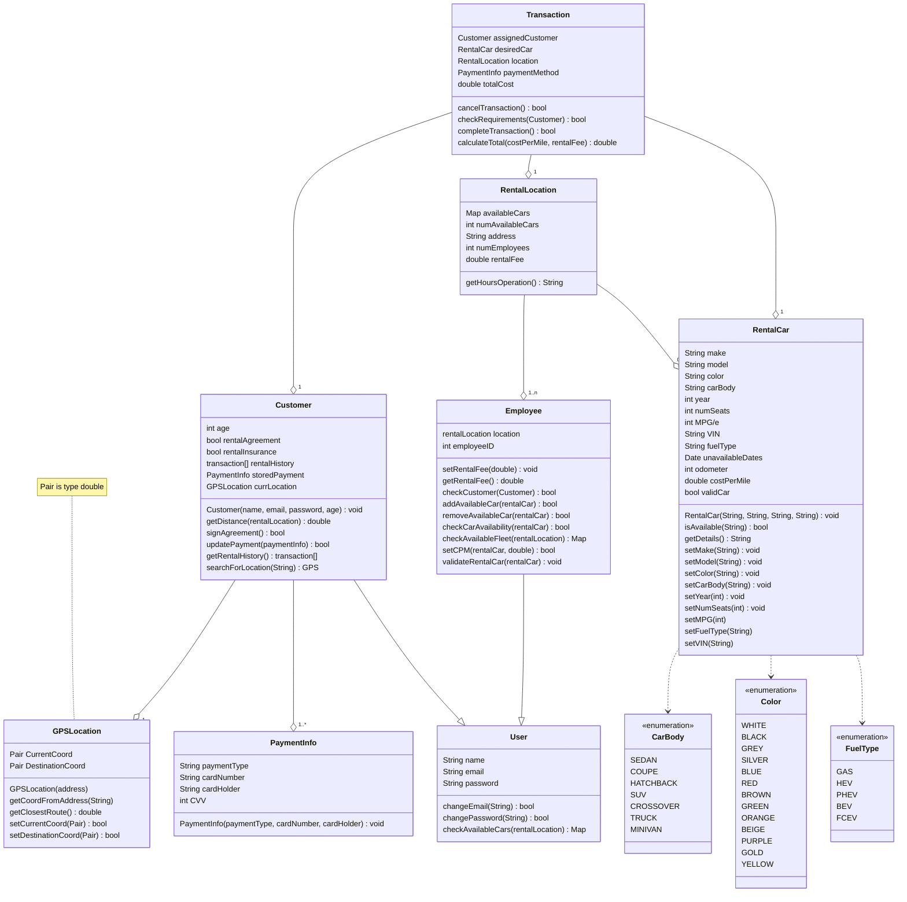

[Click here for UML Updates](https://github.com/bczuniga/CS250-Sp23-Group13/blob/main/Verification%20Test%20Plan/Test%20Suite.md#uml-diagram-updates)

# Test Suite
## Unit Testing
### Testing Unit: Car.setCarMake
> By Cameron Cobb
```c++
<void, setCarMake(name = “Toyota”)>
RentalCar.make == “Toyota”
```

This test case should not return anything, but it should set the string attribute “make” to “Toyota” in the RentalCar class. When this content of “make” is compared to the “Toyota” function argument, a value of true should be returned. This indicates that the make attribute in the RentalCar class was properly set with the function argument  “Toyota.”

```c++
<void, setCarMake(name = "") >
Rentalcar.make == ""
```

This test case should not return anything, but it should set the string attribute “make” to an empty “” string in the RentalCar class. When RentalCar’s make attribute is compared to its argument, or the “” string, a value of true is returned. This indicates that the make attribute was properly set with “”.

```c++
<void, setCarMake(name = 5)>
Error: Invalid input
```

This test case should print an error message since the function argument, 5, is not a string argument. This error message should indicate that RentalCar.make should NOT equal 5 since an incorrect type is passed as an argument to the setCarMake function. This indicates that the make attribute in RentalCar class was not properly assigned.

```c++
<void, setCarMake(name = 'c')>
Error: Invalid input
```

This test case should print an error message since the function argument, c, is not a string argument but a char argument. This error message should indicate that RentalCar.make should NOT equal ‘c’ since an incorrect type is passed as an argument to the setCarMake function. This shows that the make attribute in RentalCar class was not properly assigned.

### Testing Unit: GPSLocation [setDestinationCoord(Pair newDestination)]
> By Vincent Chu

```c++
setDestinationCoord(newDestination = 32.7774, 117.0714)
```

This test case should not return anything, and it will set the object DestinationCoord of the GPSLocation class to the two doubles. When this function is correctly executed, a value of true should be returned to the caller to indicate that it was successful.

```c++
setDestinationCoord(newDestination = 32.7774)
```

This test case should not return anything, and it will return an error because a Pair is two doubles, not one. When the error message is returned, a value of false should be returned to the caller to indicate that it was unsuccessful.

```c++
setDestinationCoord(newDestination = “32.7774”, “117.0714”)
```

This test case should not return anything, and it will return an error because a Pair is two doubles, not two Strings. When the error message is returned, a value of false should be returned to the caller to indicate that it was unsuccessful.


## Integration Testing
### Testing Integration of Employee and Car classes
> By Cameron Cobb

**RentalCar newCar(string make, string model, string color, string bodyType)**
**Employee.addAvailableCar(RentalCar)**

```c++
RentalCar newCar(make = "Toyota", model = "Prius", color = "BLACK", bodyType = "HATCHBACK")
Employee.addAvailableCar(newCar)
Employee.validateRentalCar(newCar)
newCar.validCar == true

Output: Employee.checkAvailableCar(newCar) == true
```

This test case should add the newCar RentalCar object to the availableCars Map located in RentalLocaton. The newCar RentalCar object’s attributes are set according to the string arguments: make is set to “Toyota”, model is set to “Prius”, color is set to “Black”, and carBody is set to “Hatchback”. First, Employee.validateRentalCar(newCar) should set newCar’s validCar attribute to true since string arguments passed into the object instantiation are valid and each argument matches the data that is stored in the central database. Then, newCar.validCar should return true. Employee.checkAvailableCar(newCar) should return false, indicating that the RentalCar is not currently added to the availableCars map.  newCar.validCar should return true, which means that the rental car matches the specifications stored in the database. Afterwards, the newCar object is added to the availableCars map located in the RentalLocation, which is an object of the Employee class. After the newCar is added to the availableCars map, checkAvailableCar(newCar) should return true. The test case passes for this scenario.


```c++
RentalCar newCar(make = 4500, model = “Tundra”, color = "GREY", bodyType = "TRUCK")
Employee.addAvailableCar(newCar)
Employee.validateRentalCar(newCar)
newCar.validCar == false 

Output: Employee.checkAvailableCar(newCar) == false
```

This test case should produce an error since the newCar object is not instantiated with valid arguments. Specifically, the make attribute for the RentalCar object is not properly set because the argument 4500 is an int value and not a string.  First, Employee.validateRentalCar(newCar) should set newCar’s validCar attribute to false since string arguments passed into the object instantiation is not valid. This is verified by checking that newCar.validCar is equal to false. An error message should appear saying that the newCar was not instantiated properly, so the newCar is not added to the availableCar map via the addAvailableCar(newCar) function in the Employee class since it is not a valid object of the RentalCar class. Therefore, Employee.checkAvailableCar(newCar) will return false since newCar is not a valid object, thus indicating that the new car is not added to the fleet of available cars. If any of the string arguments to the RentalCar object creation are invalid based on type, then a valid object will never be instantiated and inserted as an available car in the availableCars map.

```c++
RentalCar newCar(make = "", model = “”, color = "", bodyType = "") >
Employee.addAvailableCar(newCar)
Employee.validateRentalCar(newCar)
newCar.validCar == false 

Output: Employee.checkAvailableCar(newCar) == false
```

This test case will not produce an error since the attributes of newCar will be set to null. First, the newCar RentalCar object is instantiated with null values for its attributes make, model, color, and bodyType respectively. Employee.valiateRentalCar(newCar) should set validCar attribute of newCar to false since null values for the attributes will not be useful to the system. newCar.validCar returns false, indicating that the rental car does not meet the specifications of cars in the database. Employee.checkAvailableCar(newCar) should return false since the object should not be present in the availableCars<RentalCar> map. Employee.addAvailableCar(newCar) adds the object to the avalableCars<RentalCar> map, and Employee.checkAvailableCar(newCar) should return false, which means that the newCar object was not successfully added to the fleet of available cars and that an object with nonnull and valid string values for its members should be added to the availableCars<RentalCar> map in RentalLocation via the addAvailableCar(newCar) function in Employee class.

```c++
RentalCar newCar(make = "Subaru", model = 500, color = 65.7, bodyType = "SEDAN")
Employee.addAvailableCar(newCar)
Employee.validateRentalCar(newCar)
newCar.validCar == false 

Output: Employee.checkAvailableCar(newCar) == false
```
  
This test case should produce an error since the newCar object is not instantiated with proper arguments. Specifically, the model and color arguments are of type int and double respectively for the RentalCar object. This means that the object will not be instantiated correctly.  First, Employee.validateRentalCar(newCar) should set newCar’s validCar attribute to false since multiple arguments passed into the constructor are not valid types. An error message should appear saying that the newCar was not instantiated properly, so the newCar is not added to the availableCar map via the addAvailableCar(newCar) function in the Employee class. Therefore, Employee.checkAvailableCar(newCar) will return false since newCar is not a valid object, thus indicating that the new car is not added to the fleet of available cars. If any of the string arguments to the RentalCar object creation are invalid based on type, then a valid object will never be instantiated and inserted as an available car in the availableCars<RentalCar> map.

```c++
RentalCar newCar(make = "25252325gffgfdg", model = "fafxcv", color = "RED", bodyType = "fsftt352")
Employee.addAvailableCar(newCar)
Employee.validateRentalCar(newCar)
newCar.validCar == false 

Output: Employee.checkAvailableCar(newCar) == false
```
  
This test case should produce an error since the newCar object is not instantiated with proper arguments. Specifically, the make, model, and bodyType attributes are assigned with string values,s but these string values do not match data that is stored inthe BeAvis central car rental database and it will not be useful to our software system. First, Employee.validateRentalCar(newCar) should set newCar’s validCar attribute to false since multiple arguments passed into the constructor do not match data that is stored in the rental database. An error message should appear saying that the arguments to the CarRental class’ constructor did not match data that is stored in the database, so the newCar is not added to the availableCar map via the addAvailableCar(newCar) function in the Employee class. Therefore, Employee.checkAvailableCar(newCar) will return false since newCar’s attributes are not accurate; If any of the string arguments to the RentalCar object creation do not match information that is stored in the database, then it should not be added to the fleet of available cars.
  
### Testing Integration of checkRequirements function of the Transaction class
> By Vincent Chu
  
**Customer newCustomer(string name, string email, string password, int age)**
**checkRequirements(newCustomer)**

```c++
Customer.Hubert(name = “Hubert”, email = “hubertsmith@yahoo.com”, password = “password”, age = 58)
valid = checkRequirements(Hubert)
if (valid) print(“The customer has met the requirements”)
else print(“The customer has not met the requirements”)

Output: The customer has met the requirements
```

This test case successfully checked for Hubert’s requirements and found him to have valid documentation to be able to rent a car. The variables in the customer class are all valid and his information checks out.

```c++
Customer.Barry(name = “Barry”, email = “barrywomanilow@compuserve.com”, password = “password”, age = 17)
valid = checkRequirements(Barry)
if (valid) print(“The customer has met the requirements”)
else print(“The customer has not met the requirements”)

Output: The customer has not met the requirements
```

This test case successfully checked for Barry’s requirements and found him to have invalid documentation to be able to rent a car. The variables in the customer class are all valid but he is not old enough to rent a car.
  
```c++
Customer.Vincent(name = “Vincent”, email = “vchu5012@sdsu.edu”, password = “password”, age = “nineteen”)
valid = checkRequirements(Vincent)
if (valid) print(“The customer has met the requirements”)
else print(“The customer has not met the requirements”)

Output: The customer has not met the requirements
```

This test case unsuccessfully checked for Vincent’s requirements and found that his age variable was incorrectly defined as a String. The variables in the customer class are invalid so by default he cannot rent a car.
  
## System Testing
### Testing customer use case
> By Brendel Zuniga

Creation of new customer account, and Employee verifying the customer

```c++
// Assume that the database is already filled with cars that have been validated
Customer validCustomer(name = "Johnny", email = "johnny_appleseed@tester.com", password = "suP3rSecR3tP@SS", age = 26)
validCustomer.searchForLocation("5500 Campanile Dr, San Diego, CA 92182")

Customer invalidCustomer(name = delta, email = "", password = "weakpass", age = 12)
invalidCustomer.searchForLocation("1024 Totally Not Fake Address, ThisIsARealCity TrustMe, FK 10000")

Output:
    validCustomerGPS.CurrentCord == (32.778, -117.071)
    invalidCustomer.CurrentCord == void
```
First part of the test is to create a new customer from scratch and initialize all relevant user data: email, password, name, and age. Following that is a test to make sure that the GPS object was initialized with the proper coordinates from the address provided. On the other hand, an invalid customer would throw an error and prevent the customer from being created. Since the address provided is not a real address, there should not be any `CurrentCord` value because it couldn't be found.

```c++
// Assume an employee `testerEmployee` object exists
testerEmployee.checkCustomer(validCustomer) == false
```
After account creation of a customer, there are a few more steps that the customer needs to take before being able to process a transaction, namely signed the rental agreement and check the rental insurace on the account, as well as have a valid paymentInfo object. Because neither of these steps were taken before attempting to verify the customer, the employee function should return false. Regardless of whether or not the customer was created properly, since the `invalidCustomer` wouldn't be created in the first place.

```c++
validCustomer.signAgreement()
PaymentInfo businessDebit(Mastercard, "3423378501973298", "Johnny Appleseed", 123)
validCustomer.updatePayment(businessDebit)

Output: 
    storedPayment.rentalInsurance == true
    storedPayment.rentalAgreement == true
    storedPayment.storedPayment == businessDebit
```
In order for an employee to verify a customer as a valid customer for the purposes of the transaction functions, there must be a signed agreement and a valid payment method stored. A valid customer check by an employee should then pass at this point.

```c++
testerEmployee.checkCustomer(validCustomer) == true
```


### Testing employee use case
> By Brendel Zuniga

Adding, removing, and checking current vehicle fleet
```c++
// Adding and editing current fleet
RentalCar validCar("Toyota", "Prius", SILVER, HATCHBACK)
validCar.setYear(2019)
validCar.setNumSeats(5)
validCar.setMPG(53)
validCar.setFuelType(HEV)
validCar.setVIN("JT2BK12U530083835")

RentalCar validTruck("Ford", "F-150 Lightning", BLACK, TRUCK)
validTruck.setYear(2023)
validTruck.setNumSeats(5)
validTruck.setMPG(78)
validTruck.setFuelType(BEV)
validTruck.setVIN("1FTNW21L41EB18470")

RentalCar invalidCar("Subuwu", "Impretzel", GOLD, SEDAN)
invalidCar.setYear(1000)
invalidCar.setNumSeats(-1)
invalidCar.setMPG(-20)
invalidCar.setFuelType("None")
invalidCar.setVIN("21DSFJKLJF9320")

RentalCar inProgressCar("Toyota", "Corolla", RED, SEDAN)
inProgressCar.setYear(2013)
inProgressCar.setNumSeats(5)
inProgressCar.setMPG(24)
inProgressCar.setFuelType(GAS)
inProgressCar.setVIN("21DSFJKLJF9320ERS9820")

validCar.getDetails()
validTruck.getDetails()
invalidCar.getDetails()
inProgressCar.getDetails()
Output:
    "2019 Toyota Prius"
    "2023 Ford F-150 Lightning"
    "Error: invalid vehicle"
    "2013 Toyota Corolla"
```
What we're testing here is if we were to try to first, create vehicles to be added to a location's fleet. In order to check if a car was successfully created, then a `.getDetails()` function would return with the proper output with included details. The function call on an invalid vehicle, or a vehicle that does not exist, would simply throw an error.

```c++
// Assuming that there exists a `testerEmployee` whose location is set to SDSU
Employee testerEmployee(SDSU)

testerEmployee.validateRentalCar(validCar) == true
testerEmployee.validateRentalCar(validTruck) == true
testerEmployee.validateRentalCar(invalidCar) == false
```
Once the objects have been created properly, the `validateRentalCar` check should return true because all of the necessary information has been populated. It should only fail on the object that did not meet the requirements. We purposefully did not validate the Toyota Corolla because we will use it's invalidated status to test against later on.

```c++
// Assuming that there exists a rental location `SDSU` and `UCSD` with cars already in the fleet
SDSUFleet = testerEmployee.checkAvailableFleet(SDSU)
UCSDFleet = testerEmployee.checkAvailableFleet(UCSD)
```
This should return a Map of rentalCars that is associated with that specific location.

```c++
testerEmployee.addAvailableCar(validCar) == true
testerEmployee.addAvailableCar(validTruck) == true
testerEmployee.addAvailableCar(invalidCar) == false
testerEmployee.addAvailableCar(inProgressCar) == false
```
The `addAvailableCar` function should only ever modify the testerEmployee's rentalLocation's fleet. The program should add `validCar` and `validTruck` without any issue because it's been validated by an employee. The `invalidCar` should fail because the object was not created properly, therefore making it ineligible for validation. The `inProgressCar` should also return false; even though the object was created properly with valid inputs, it has yet been validated by an employee, therefore not being able to add the vehicle to the fleet.

```c++
(SDSUFleet == testerEmployee.checkAvailableFleet(SDSU)) == false
(UCSDFleet == testerEmployee.checkAvailableFleet(UCSD)) == true 
```
These two lines compare the fleet before and after cars have been added to verify that the cars were only added to the employee's fleet and not a different fleet. This also checks if they were added properly since the number of cars in the fleet should have changed

```c++
testerEmployee.removeAvailableCar(validCar) == true
testerEmployee.removeAvailableCar(validTruck) == true
testerEmployee.removeAvailableCar(nonExistentCar) == false
```
And finally, these two lines should determine whether or not the remove function works as expected; since `validCar` and `validTruck` were previously added, they could be removed without hitch. Since nonExistentCar is not in the fleet, it would return false because there's nothing to remove in the first place.

# UML Diagram Updates



## Enumerations
We have three enumerations for CarBody, Color, and FuelType that the RentalCar class will use. Because of the variability in how an employee could input these values, we've streamlined it using these enumerations to keep it consistent across all cars.
## User
The `User` class is a superclass of both `Customer` and `Employee`. The user class is what lets us create individual account access to the system. The `User` class contains name, email, and password that is required for either types of accounts. The functions that are in the class is general account manipulation and availability of vehicles given a location it gets passed
### Customer
The `Customer` class inherits the `User` class that covers the functions and members that a customer would need to manipulate their rental account. The class also contains relevant documents such as `rentalAgreement` and `rentalInsurance` required to complete a transaction. In this class, the `GPSLocation`, and `PaymentInfo` are used as well which will be described later in the document.
### Employee
The `Employee` class now includes a validation method that checks if the customer has the proper documents and is of age in order to rent a vehicle. The changes also include functions that allow an Employee to add, modify, or remove cars in an existing fleet at a location.
## Payment info
The `PaymentInfo` class is another object that a customer creates either one or more instances of. This class contains credit card information that can be stored and used for future transactions.
## GPS Location
The `GPSLocation` class manages directions to and from a customers location to a given rental location using coordinates that the class finds given an address string passed by the customer. Any function that requires location for finding directions of will use the `GPSLocation` class. It now utilizes Pairs and GPS coordinates that allows for precise locations.
## RentalCar
The `RentalCar` class has new setters to update the class's members such as `make`, `model`, `color`, `carBody`, `year`, and `setNumSeats`.
## RentalLocation
Added an `availableCars<map>` that contains available vehicles at a given RentalLocation.
